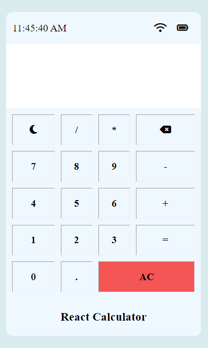
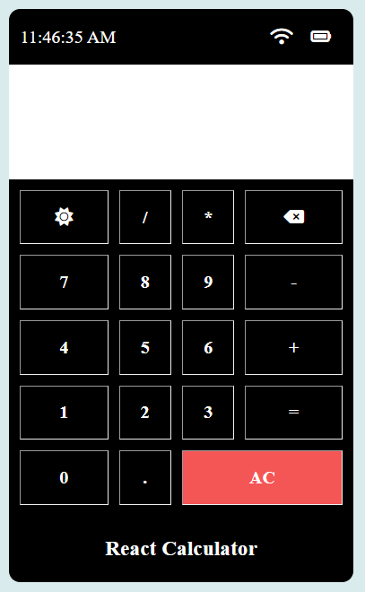

# React Calculator

This is a simple calculator application build to perform basic mathematical operations such as addition, subtraction,multiplication,division,etc.

# Demo

https://calculator-6lyn.onrender.com/

# Feature

1. Addition
2. Subtraction
3. Multiplication
4. Division
5. Clear All
6. Delete one
7. Toggle theme (light/dark)

# Getting Started

## Installation

1. Clone the repository

```
https://github.com/shaikhsohel0082/calculator.git
```

2. Install Dependencies

```
npm install
```

3. Start application

```
npm start
```

4. Open in browser
   Open your browser and navigate to http://localhost:3000

## Screenshots





## Contributing

Contributions are always welcome!

Please feel free to submit a Pull Request.

## License

This project is licensed under the [MIT](https://choosealicense.com/licenses/mit/) License

## Acknowledgements

- Creted as a part of React skill test for Coding Ninjas.
- Inspired by various calculator designs and implementations.
